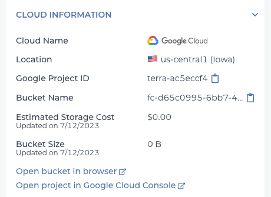
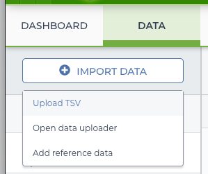
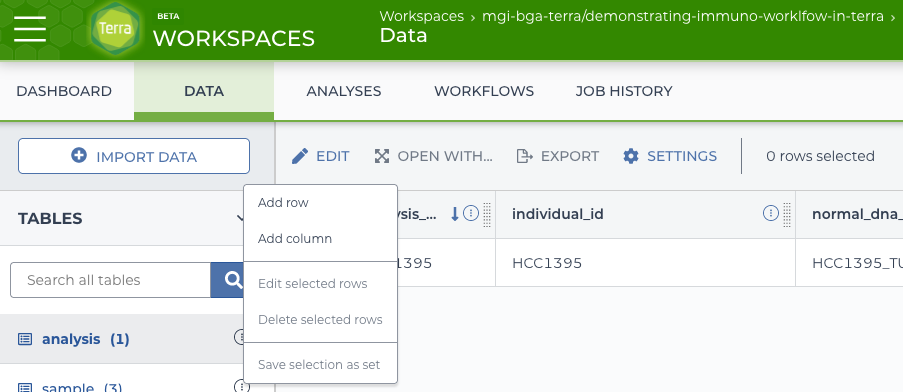
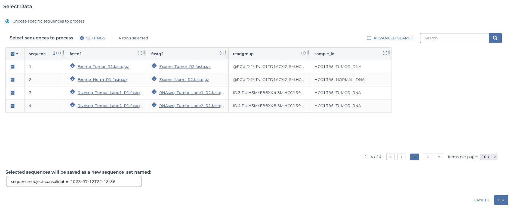
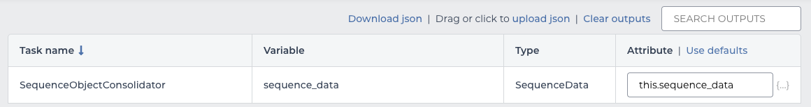
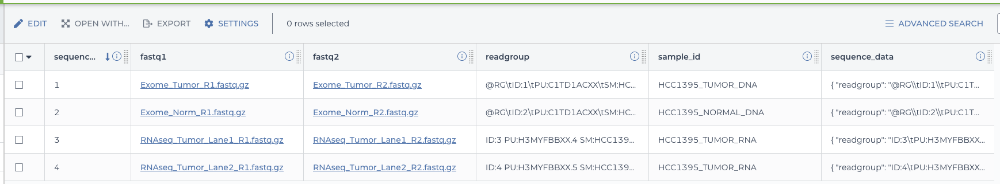

# Running a Workflow in Terra

## Prerequisites

To complete this walkthrough you'll need to have access to a billing account in GCP.  The [cloud-workflows repo has more information on setting this up](https://github.com/wustl-oncology/cloud-workflows/blob/main/docs/getting_started_gcp.md).  Then, if you haven't used Terra before, you'll have to create a Terra billing project. Terra has [detailed documentation on setting this up](https://support.terra.bio/hc/en-us/articles/360026182251).

## Workspace

All work in Terra happens in a workspace. Your workspaces are listed on the [workspaces page](https://app.terra.bio/#workspaces). It also has a button to create a workspace (the plus to the right of the word Workspaces).


A unique and memorable name will make it easier to find later.  This walkthrough will use "demonstrating-immuno-worklfow-in-terra".  After choosing a name, a billing project must be selected.


## Adding Data

The immuno workflow requires BAM or FASTQ files to be available as inputs.  This walkthrough will use the HCC1395 data available here:

* [HCC1395 Normal](http://genomedata.org/pmbio-workshop/fastqs/all/Exome_Norm.tar)
* [HCC1395 Tumor](http://genomedata.org/pmbio-workshop/fastqs/all/Exome_Tumor.tar)
* [HCC1395 Tumor RNA](http://genomedata.org/pmbio-workshop/fastqs/all/RNAseq_Tumor.tar)

These files will need to be extracted and uploaded to Terra. First extract all of these tar files to a `sequence_data` directory.  Then, there are a few ways to upload that directory to Terra:

### Uploading via Terra UI

On the "Data" tab for the workspace will be a "Files" link under "Other Data".  From that section there is an "Upload" button that can be used to upload the desired data.


### Uploading via Command Line

On the "Dashboard" tab for the workspace will be a link to the Google Cloud Storage Bucket for the workspace.  By copying this bucket URL, the files can be uploaded using the `gsutil` tool.



### A note about sharing data across workspaces.

If the same data will be used by many people, it may be beneficial to upload it to a workspace and configure it once.  Thereafter that workspace can be cloned to use the data in another workspace without copying it again thereby saving storage costs.  The data tables configured below could also be cloned to the new workspace.

## Populating Terra Tables

For this example, there will be three data tables: "sequence" (to list the information for each pair of input FASTQs), "sample" (for any metadata about the samples), and "analysis" (to group together the sequences and samples for one workflow run).  In the simplest case a workflow can be run from a single table (or by supplying an input JSON directly); the additional tables here are to demonstrate some of the linking features of Terra.

### Adding the "sequence" table.

On the "Data" tab of the workspace is an "Import Data" button.  Clicking on it offers a few options--in this case use the import TSV option.



This offers the option to upload a file or to copy and paste the TSV.  To create the "sequence" table, start with the following:

```
entity:sequence_id	sample_id	fastq1	fastq2	readgroup
1	HCC1395_TUMOR_DNA	gs://BUCKET/sequence_data/Exome_Tumor/Exome_Tumor_R1.fastq.gz	gs://BUCKET/sequence_data/Exome_Tumor/Exome_Tumor_R2.fastq.gz	@RG\tID:1\tPU:C1TD1ACXX\tSM:HCC1395_TUMOR_DNA\tLB:HCC1395_TUMOR_DNA_LIB1\tPL:Illumina\tCN:WUGSC
2	HCC1395_NORMAL_DNA	gs://BUCKET/sequence_data/Exome_Norm/Exome_Norm_R1.fastq.gz	gs://BUCKET/sequence_data/Exome_Norm/Exome_Norm_R2.fastq.gz	@RG\tID:2\tPU:C1TD1ACXX\tSM:HCC1395_NORMAL_DNA\tLB:HCC1395_NORMAL_DNA_LIB1\tPL:Illumina\tCN:WUGSC
3	HCC1395_TUMOR_RNA	gs://BUCKET/sequence_data/RNAseq_Tumor/RNAseq_Tumor_Lane1_R1.fastq.gz	gs://BUCKET/sequence_data/RNAseq_Tumor/RNAseq_Tumor_Lane1_R2.fastq.gz	"ID:3	PU:H3MYFBBXX.4	SM:HCC1395_TUMOR_RNA	LB:HCC1395_TUMOR_RNA_LIB1	PL:Illumina	CN:WUGSC"
4	HCC1395_TUMOR_RNA	gs://BUCKET/sequence_data/RNAseq_Tumor/RNAseq_Tumor_Lane2_R1.fastq.gz	gs://BUCKET/sequence_data/RNAseq_Tumor/RNAseq_Tumor_Lane2_R2.fastq.gz	"ID:4	PU:H3MYFBBXX.5	SM:HCC1395_TUMOR_RNA	LB:HCC1395_TUMOR_RNA_LIB1	PL:Illumina	CN:WUGSC"
```

The bucket paths need to be updated to point to the uploaded files for this workspace by filling in the `BUCKET`.  Notice the headers of this file... the first column starts with `entity:` to indicate this column identifies the table.  Since it says `sequence_id` the table will be named "sequence".  For this table, the file import must be used as the text uploader does not handle fields that contain tabs.


### Adding the Sample table.

This time the text import can be used by copying this block:

```
entity:sample_id	individual_id	type
HCC1395_TUMOR_DNA	HCC1395	tumor_dna
HCC1395_NORMAL_DNA	HCC1395	normal_dna
HCC1395_TUMOR_RNA	HCC1395	tumor_rna
```

This will create a "sample" table.


### Adding the Analysis table.

As before, open the TSV import and copy this block:

```
entity:analysis_id	individual_id	tumor_dna_sample	normal_dna_sample	tumor_rna_sample
HCC1395	HCC1395	{"entityType":"sample","entityName":"HCC1395_NORMAL_DNA"}	{"entityType":"sample","entityName":"HCC1395_TUMOR_DNA"}	{"entityType":"sample","entityName":"HCC1395_TUMOR_RNA"}
```

Notice this table has some entities in the columns.  This will automatically link those entries to the "sample" table.  This allows access to properties of the "sample" table via this table.  If there were another table for individuals, the "sample" table could've been created with links to that table for further nested indirect access.

### Linking to sequences in the analysis table.

Now that the basic tables are in place, there are a few more steps to do before using the workflow.  First is to  add columns to the analysis table to point to which sequence applies.  From the "analysis" table, there is an edit button with an option to "Add Column".  Use it three times, one for each sample.



Each time, use a type of "reference" to the "sequence" table and select the option that the values are a list.

The three columns to add and their values:

| column               | value |
| -------------------- | ----- |
| tumor_dna_sequences  | 1     |
| normal_dna_sequences | 2     |
| tumor_rna_sequences  | 3,4   |

The option to use a list is selected every time because the workflow expects a list of data, even if some lists only contain one item.


As a note, although this walkthrough used the Terra UI to demonstrate adding a column to the workflow, it would've been possible to create these entities in the TSV directly and skip this step so long as the column is formatted correctly. An example of how to format a list in the TSV:

```
[{"entityType":"sequence","entityName":"1"},{"entityType":"sequence","entityName":"2"}]
```

### Formatting a sequence entry in the sequence table.

The Terra interface does not support adding a JSON object directly as a single column unless that object is the output of a workflow.  Therefore a separate zero-step WDL workflow is needed in order to format the sequence objects in the way the `immuno.wdl` expects. This is a great opportunity to see a simple case of setting up a workflow before moving on to the full immuno workflow.

#### Pulling the sequence formatter workflow from Dockstore

First, visit the dockstore page for the workflow:
<!-- TODO Should version this. Should it get promoted to being official instead of in tmooney namespace? -->
* [sequence-object-consolidator](https://dockstore.org/workflows/github.com/tmooney/sequence-object-consolidator:master?tab=info)

At the right side of this page is a "Launch with..." section.


 Choosing Terra opens a Terra page to select a workspace.


Once the correct workspace is chosen Terra will open the Workflows tab.  This is the main page for configuring the many options for a WDL workflow.

#### Selecting the workflow data.

In this case, the "Run workflow(s) with inputs defined by data table" is used to point to the data that was set up.  Choose "sequence" for the table to run on.


Next there is a "SELECT DATA" button. In the dialogue, select all four of the sequence entities.



This will automatically define a sequence set containing these four items.  You can give it a custom name if desired or accept the default.

#### Setting the workflow options.

The call caching doesn't matter for this workflow, so the default is fine.  There are no intermediate outputs, but it's a good idea to be in the habit of remembering to select the box to delete them, so go ahead and mark it.  The other options can remain unselected--we're not using reference data, this workflow has no steps, so there is nothing to retry, and we shouldn't have any empty outputs possible.


These options reset every time, so be sure to check that they are configured appropriately before each run.  Forgetting to delete intermeidate outputs can be expensive over time!

#### Setting the workflow inputs.

The inputs to this workflow match the columns in the sequence table, so each input maps to the corresponding column by prepending it with `this.`:

| input     | value          |
| --------- | -------------- |
| fastq1    | this.fastq1    |
| fastq2    | this.fastq2    |
| readgroup | this.readgroup |


The workflow will run once per sequence entity selected above. For each run, `this` will refer to one row in the table and pull the appropriate value.

#### Setting the workflow outputs.

This workflow has only one output, so wire it up like the inputs.

| output        | value              |
| ------------- | ------------------ |
| sequence_data | this.sequence_data |



When the workflow runs this will automatically add a column to the sequence table named "sequence_data" with the output.  As with the inputs, this happens once per row to fully populate the new column.

#### Launching the workflows.

Since four rows were selected from the sequence table, this will launch four workflows--one per row.  A dialogue after clicking "RUN ANALYSIS" will confirm this number.  And then it will launch!


#### Seeing the results.

These workflows complete quickly so you should soon receive an e-mail with the success or failure status.  Assuming they succeeded, returning to the Data tab and selecting the sequence table should show the additional column with the sequence data objects properly formatted for the `immuno.wdl` workflow.



## Setting up the `immuno.wdl` workflow.

Now that all the input data is ready, it's time to do the configure the `immuno.wdl` workflow.

### Pulling the `immuno.wdl` workflow from Dockstore

First visit the dockstore page for the workflow:
<!-- TODO do we want to link to specific version or let dockstore default prevail? -->
* [immuno.wdl](https://dockstore.org/workflows/github.com/wustl-oncology/analysis-wdls/immuno)

As before, choose the "Launch with" option for "Terra".

### Selecting the workflow data.

As before, choose "Run workflow(s) with inputs defined by data table", but this time choose the "analysis" table.  In the "SELECT DATA" dialogue choose the one and only row, for HCC1395.

### Setting the workflow options.

Call caching can be turned on if desired--should the workflow fail this will allow it to shortcut previously successful steps.  Once again it's a good idea to select the "Delete intermediate outputs" option--though note that call caching won't work once a run completes and the intermediate outputs have been deleted.  The other options can remain unselected.

### Setting the workflow inputs.

#### Static inputs

This time there are far more inputs to deal with.  Thankfully, most of them are static values.  If starting from scratch there is a link to download a JSON template that can be filled in and re-uploaded.  An existing JSON from a manual run works, too.  For this example, there's [an existing YAML](https://github.com/wustl-oncology/immuno_gcp_wdl_compute1/blob/main/example_yamls/human_GRCh38_ens105/hcc1395_immuno_cloud-WDL.yaml) that can be used.  It will need to be converted to JSON for use in Terra.  There are many ways to do this conversion; one is an online tool like <https://jsonformatter.org/yaml-to-json>.  Using the "Upload JSON" we'll use this to fill in most of the inputs.

#### Linking to the data table

Several inputs need link to the data table, so these will need to be filled in to replace the values from the uploaded JSON (if any were set).

| input              | value                                   |
| ------------------ | --------------------------------------- |
| normal_sample_name | this.normal_dna_sample.sample_id        |
| normal_sequence    | this.normal_dna_sequences.sequence_data |
| rna_sequence       | this.tumor_rna_sequences.sequence_data  |
| sample_name        | this.tumor_rna_sample.sample_id         |
| tumor_sample_name  | this.tumor_dna_sample.sample_id         |
| tumor_sequence     | this.tumor_dna_sequences.sequence_data  |

This shows how when a table contains references to another one, you can refer to columns of the other tables through the relationships established.

### Setting the workflow outputs.

Every output from the workflow can be added as a column to the datatable. Choose "Use defaults" to automatically populated all the outputs to columns of the same name.

### Launching the workflow

Now we're ready to "Launch Analysis".  This time, we only have one row so it will launch a single workflow to dothe work.  For this immuno.wdl, it will take a few days to run to completion on the HCC1395, so now we wait.  Terra should send an e-mail once the workflow either succeeds or fails.

### Viewing the results

After the run, there are several ways to examine the results.

#### In the data table

The outputs that were specified will be added as columns to the "analysis" datatabe.


#### From the command-line

This table is now very wide!  It may be useful to select the row and export it as a TSV to view.


There is also a command-line tool to pull data from a terra workspace.  To pull the analysis table:

```
pip install firecloud
fissfc entity_tsv -p TERRA_BILLING_PROJECT -w WORKSPACE -t analysis -m flexible
```

For more about this command, see [this Terra documentation page](https://support.terra.bio/hc/en-us/articles/360042259232-How-to-Manage-data-with-the-FISS-API).

#### In the Job History

For a more comprehensive view of what happened in the workflow, the Job History view can be used.


This will hahve the attempts to run both the immuno and sequence-object-consolidator workflows.  Clicking on the immuno workflow will load a details page for digging in.


The "Job Manager" link on this page will show the inputs, outputs, and timings of each step in the workflow and the "Execution Directory" link will lead to the Google bucket where cromwell did its work.  If intermediate outputs were not set to be deleted, they will also be in this location along with the final results.

For more on the job manager, see [this Terra documentation page](https://support.terra.bio/hc/en-us/articles/360037096272-Job-History-overview-monitoring-workflows-).

## Further information

Terra maintains [extensive documentation](https://support.terra.bio/hc/en-us/categories/360001399872-Documentation) including some video walkthroughs of the basics of using various features of the platform.

